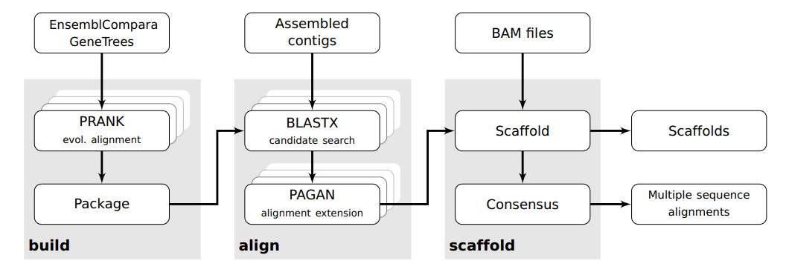

# Glutton

Glutton is a novel tool to process transcriptome assemblies for downstream evolutionary analyses. Glutton takes as input a set of fragmented, possibly erroneous transcriptome assemblies. Utilising phylogeny-aware alignment and reference data from a closely related species, it reconstructs one transcript per gene, finds orthologous sequences and produces accurate multiple alignments of coding sequences.

The method is described in a preprint at [https://www.biorxiv.org/content/10.1101/077511v1](https://www.biorxiv.org/content/10.1101/077511v1).

